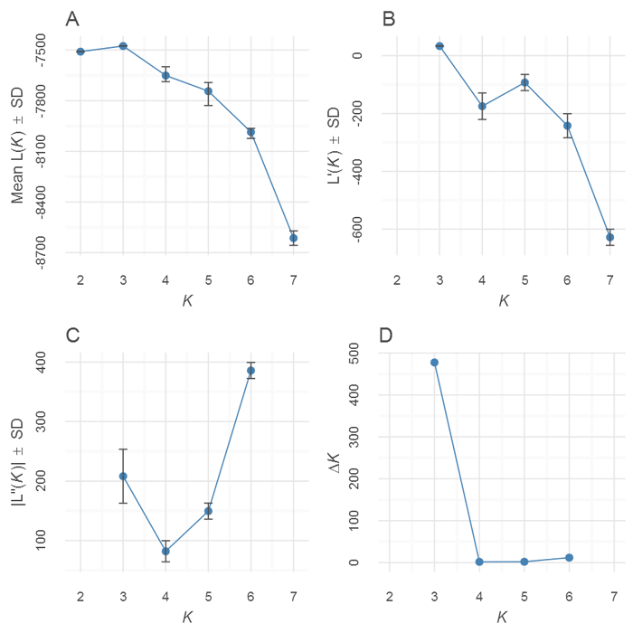
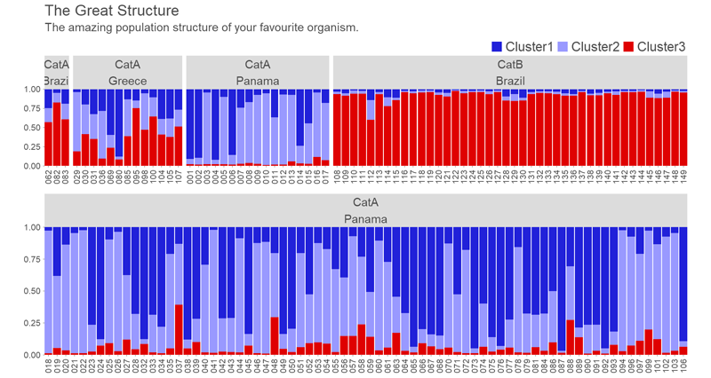

# pophelper 2.2.7

`pophelper` is an R package and web app to analyse and visualise population structure. `pophelper` curently supports output run files generated from population analysis programs such as STRUCTURE, TESS, TESS3, BAPS and numeric delimited formats such as ADMIXTURE or fastSTRUCTURE. The `pophelper` package can be used to read run files to R, tabulate runs, summarise runs, estimate *K* using the Evanno method, align clusters within K using CLUMPP, export files for DISTRUCT and generate barplot figures.  

For a detailed demonstration and walkthrough, refer the online [vignette](http://royfrancis.github.io/pophelper/). For information about changes in the latest version, visit [this GitHub page](https://github.com/royfrancis/pophelper/releases).

## Installation  
You need to have R (> 3.4.0) statistical package installed on your system. [R](https://www.r-project.org/) is open-source and freely available to download for Windows, Mac and other OS. Then, install the dependency packages. Then, you can install `pophelper` from `github` using the `devtools` package.  

```coffee
# install dependencies and devtools
install.packages(c("Cairo","ggplot2","gridExtra","gtable","tidyr","devtools"),dependencies=T)

# install pophelper package from GitHub
devtools::install_github('royfrancis/pophelper')

# load library for use
library(pophelper)
```

Note that `pophelper 1.2.0` and later includes binary executables for CLUMPP and DISTRUCT. This is experimental and may not work on all OS and versions.

`pophelper` has been tested on the following systems: 

+ Windows 10 64bit, R 3.4.3
+ Windows 7 64bit, R 3.4.3 (DISTRUCT is unstable)
+ Windows 7 64bit, R 3.4.0 (DISTRUCT is unstable)
+ Scientific Linux 6.8 (Carbon) 64bit, R 3.4.0

## Web App   
An online interactive version of pophelper is available at [pophelper.com](http://www.pophelper.com). The web app is quite outdated and limited in terms of functionality and flexibility. The web app must not be used for major work or large datasets. The web app is also limited in computational power and working hours. The web app will be automatically restricted after 100 hours of use per month. If anyone has ideas for funding `pophelper` web server, please get in touch.  

## Features

+ Read q-matrices from STRUCTURE, TESS 2.3, TESS 3, BAPS, fastSTRUCTURE, ADMIXTURE runs.
+ Tabulate/summarise reads.
+ Compute Evanno method to estimate K for STRUCTURE runs.
+ Aligned clusters for single K using CLUMPP.
+ Single line and multiline barplots with labelling, sorting and subsetting.
+ Export files for use with DISTRUCT.

## Sample figures

  
__Fig:__ *Workflow for all filetypes.*  

  
__Fig:__ *Plots from Evanno method.*  

  
__Fig:__ *Singleline barplots from q-matrices with individual and group labelling.*  

  
__Fig:__ *Multiline barplots from q-matrices with individual and group labelling.* 

For detailed demonstration and description, refer the [vignette](http://royfrancis.github.io/pophelper/).

### Disclaimer

The `pophelper` R package is offered free and without warranty of any kind, either expressed or implied. I will not be held liable to you for any damage arising out of the use, modification or inability to use this program. Please make sure you verify all your results.  

### Contact

If you have an comments, suggestions, corrections or ideas on ways to improve or extend this package, feel free to contact me. Submit a report on the [Github issues page](https://github.com/royfrancis/pophelper/issues).  

2018 | Roy M Francis  
