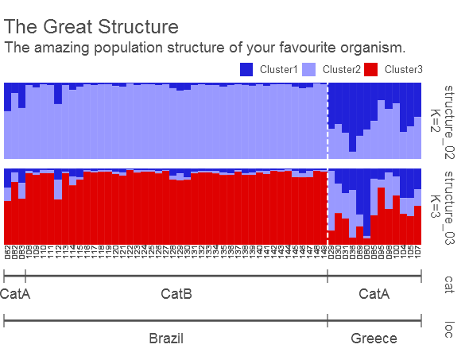

# pophelper 

**pophelper** is an R package and web app to analyse and visualise population structure. **pophelper** curently supports output run files generated from population analysis programs such as STRUCTURE, TESS, TESS3, BAPS and numeric delimited formats such as ADMIXTURE or fastSTRUCTURE. The **pophelper** package can be used to read run files to R, tabulate runs, summarise runs, estimate *K* using the Evanno method, align clusters within and across K and generate barplot figures.  

For a detailed demonstration and walkthrough, refer the online vignette. For information about changes in the latest version, check version history.

## Latest changes

* Fixed a bug in Evanno plot. Error bars on the first plot showed MIN/MAX rather than SD. This has been fixed to show SD.
* All functions that export content must have `exportpath` specified explicitly.
* `cat` and `print` statements replaced with `message` or `warning`
* Argument 'quiet' removed in all functions

## Installation  

You need to have R (>= 3.5) statistical package installed on your system. [R](https://www.r-project.org/) is open-source and freely available to download for Windows, Mac and other OS.

Linux users may need some extra OS specific dependencies. Here are the libraries for Debian (Ubuntu etc).

```
sudo apt install -y libfreetype6-dev libcurl4-openssl-dev libssl-dev libxml2-dev libnlopt-dev
```

Mac users may also need to install **openssl**. Then, install the dependency R packages.

```coffee
# install dependencies
install.packages(c("ggplot2","gridExtra","label.switching","tidyr","remotes"),repos="https://cloud.r-project.org")
```

Then, you can install from GitHub using the `remotes` package.

```coffee
# install pophelper package from GitHub
remotes::install_github('royfrancis/pophelper')
```

Finally, load the library for use.

```coffee
# load library for use
library(pophelper)
```

## Features

+ Read q-matrices from STRUCTURE, TESS2.3, TESS3R, BAPS, fastSTRUCTURE, ADMIXTURE runs and CLUMPP.
+ Tabulate/summarise reads.
+ Compute Evanno method to estimate K for STRUCTURE runs.
+ Align clusters (label switching) within and across K.
+ Single line and multiline barplots with labelling, sorting and subsetting.

## Sample figures

  
__Fig:__ *Workflow for many different file types.*  

  
__Fig:__ *Plots from Evanno method.*  

  
__Fig:__ *Singleline barplots from q-matrices with individual and group labelling.*  

  
__Fig:__ *Multiline barplots from q-matrices with individual and group labelling.*

For detailed demonstration and description, refer the vignette.

## Web App   

An interactive version of pophelper using shiny web framework is available as [pophelperShiny](https://github.com/royfrancis/pophelperShiny).

## Citation 

> Francis, R. M. (2017). POPHELPER: an R package and web app to analyse and visualize population structure. _Molecular Ecology Resources, 17_(1), 27-32. DOI: 10.1111/1755-0998.12509

## Disclaimer

This R package is offered free and without warranty of any kind, either expressed or implied. I will not be held liable to you for any damage arising out of the use, modification or inability to use this program. This R package can be used, redistributed and/or modified freely for non-commercial purposes subject to the original source being properly cited. Licensed under GPL-3. Please make sure you verify all your results.  

## Contact

If you have an comments, suggestions, corrections or ideas on ways to improve or extend this package, feel free to submit a report on the [Github issues page](https://github.com/royfrancis/pophelper/issues).  
