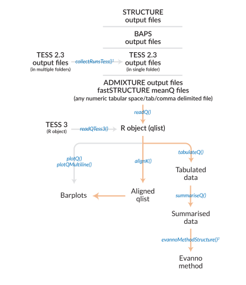

# pophelper 

**pophelper** is an R package and web app to analyse and visualise population structure. **pophelper** curently supports output run files generated from population analysis programs such as STRUCTURE, TESS, TESS3, BAPS and numeric delimited formats such as ADMIXTURE or fastSTRUCTURE. The **pophelper** package can be used to read run files to R, tabulate runs, summarise runs, estimate *K* using the Evanno method, align clusters within and across K and generate barplot figures.  

For a detailed demonstration and walkthrough, refer the online vignette. For information about changes in the latest version, visit [this GitHub page](https://github.com/royfrancis/pophelper/releases).

## Latest changes

* Fixed a bug in Evanno plot. Error bars on the first plot showed MIN/MAX rather than SD. This has been fixed to show SD.

## Installation  

You need to have R (> 3.5.0) statistical package installed on your system. [R](https://www.r-project.org/) is open-source and freely available to download for Windows, Mac and other OS. 

Linux users may need some extra OS specific dependencies: freetype, libcurl, libssl and libxml. Here is installation for Debian (Ubuntu etc)

```
sudo apt-get install -y libfreetype6-dev libcurl4-openssl-dev libssl-dev libxml2-dev
```

Mac users may also need to install openssl. Then, install the dependency packages. 

```coffee
# install dependencies and devtools
install.packages(c("ggplot2","gridExtra","gtable","label.switching","tidyr","devtools"),dependencies=T)
```

Then, you can install from `github` using the `devtools` package. 

```coffee
# install pophelper package from GitHub
devtools::install_github('royfrancis/pophelper')
```

Finally, load the library for use.

```coffee
# load library for use
library(pophelper)
```

**pophelper** has been tested on the following systems: 

+ Ubuntu 18.04, R 3.5
+ Ubuntu 18.04, R 3.6
+ Windows 10, R 3.5
+ Windows 10, R 3.6

## Features

+ Read q-matrices from STRUCTURE, TESS2.3, TESS3R, BAPS, fastSTRUCTURE, ADMIXTURE runs and CLUMPP.
+ Tabulate/summarise reads.
+ Compute Evanno method to estimate K for STRUCTURE runs.
+ Align clusters (label switching) within and across K.
+ Single line and multiline barplots with labelling, sorting and subsetting.

## Sample figures

  
__Fig:__ *Workflow for all file types.*  

  
__Fig:__ *Plots from Evanno method.*  

  
__Fig:__ *Singleline barplots from q-matrices with individual and group labelling.*  

  
__Fig:__ *Multiline barplots from q-matrices with individual and group labelling.* 

For detailed demonstration and description, refer the vignette.

## Web App   

An interactive version of pophelper using shiny web framework is available as [pophelperShiny](https://github.com/royfrancis/pophelperShiny). This app can be installed locally as an R package. A preview is available online at [pophelper.com](http://www.pophelper.com). The online app must not be used for major work or large datasets. It is limited in computational power and working hours. The web app will be automatically restricted after 25 hours of use per month.

### Disclaimer

The **pophelper** R package is offered free and without warranty of any kind, either expressed or implied. I will not be held liable to you for any damage arising out of the use, modification or inability to use this program. **pophelper** R package can be used, redistributed and/or modified freely for non-commercial purposes subject to the original source being properly cited. Licensed under GPL-3. Please make sure you verify all your results.  

### Contact

If you have an comments, suggestions, corrections or ideas on ways to improve or extend this package, feel free to submit a report on the [Github issues page](https://github.com/royfrancis/pophelper/issues).  
